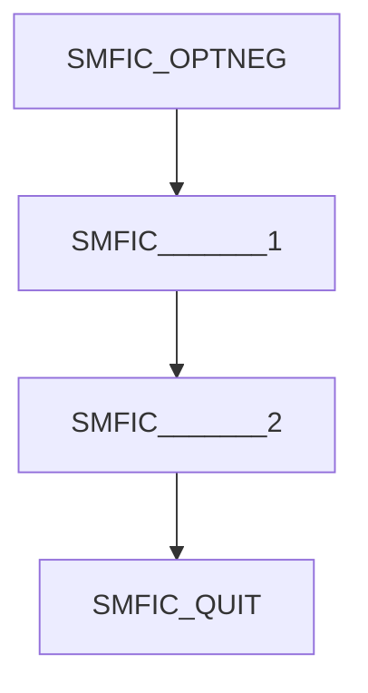

# Nager.MtaMilter

## Overview
Nager.MtaMilter is a C# implementation of an MTA Milter, providing the core logic for the Milter protocol. This project enables seamless integration with popular mail servers such as Postfix, Sendgrid, and Stalwart. It focuses primarily on implementing the Milter protocol and handling various Milter events.

## Features
- Pure C# implementation of the Milter protocol
- Compatible with Postfix, Sendgrid, Stalwart, and other MTA systems
- Event-driven handling of mail processing steps
- Lightweight and modular design

## Supported Events
Nager.MtaMilter can react to the following Milter protocol events:

| Event | Command Byte | Description | Required |
|-------|-------------|-------------|----------|
| `SMFIC_OPTNEG` | `0x4F` | Protocol negotiation | Yes |
| `SMFIC_QUIT` | `0x51` | Quit communication | Yes |
| `SMFIC_MACRO` | `0x44` | Macro definition | No |
| `SMFIC_CONNECT` | `0x43` | Connection information | No |
| `SMFIC_MAIL` | `0x4D` | MAIL FROM command | No |
| `SMFIC_RCPT` | `0x52` | RCPT TO command | No |
| `SMFIC_DATA` | `0x54` | DATA command, signals the start of the message body but contains no actual data | No |  
| `SMFIC_HEADER` | `0x4C` | Mail header | No |
| `SMFIC_EOH` | `0x4E` | End of headers | No |
| `SMFIC_BODY` | `0x42` | Message body | No |
| `SMFIC_BODYEOB` | `0x45` | End of body | No |


## Default message sequence




## Development
Tested with Stalwart Mail Server. During development, I used the Stalwart Mail Server to test and validate Nager.MtaMilter. The integration was successful, ensuring compatibility with the Milter protocol.

### Stalwart Mail Server Documentation

Find installation and configuration details in the official documentation: [Stalwart Mail Server Docs](https://stalw.art/docs/install/docker/)

### Running Stalwart Mail Server with Docker

```
docker run -d -ti -p 443:443 -p 8080:8080 -p 25:25 -p 587:587 -p 465:465 -p 143:143 -p 993:993 -p 4190:4190 -p 110:110 -p 995:995 -v c:\Temp\stalwart:/opt/stalwart-mail --name stalwart-mail stalwartlabs/mail-server:latest
```

**Send test mail via telnet**
```
helo test.de
mail from:<sender@test.de>
rcpt to:<test@test.de>
data
354 Start mail input; end with <CRLF>.<CRLF>
Date: Sun, 09 Mar 2025 06:28:30 -0700
From: Max <max@test.com>
To: "Muster" <muster@test.de>
Subject: Test Mail


test mail

.
```

**Milter Configuration**


## Contributing
Contributions are welcome! Feel free to submit issues, feature requests, or pull requests via GitHub.

## License
This project is licensed under the MIT License.

## Author
Created and maintained by [nager](https://github.com/nager).
